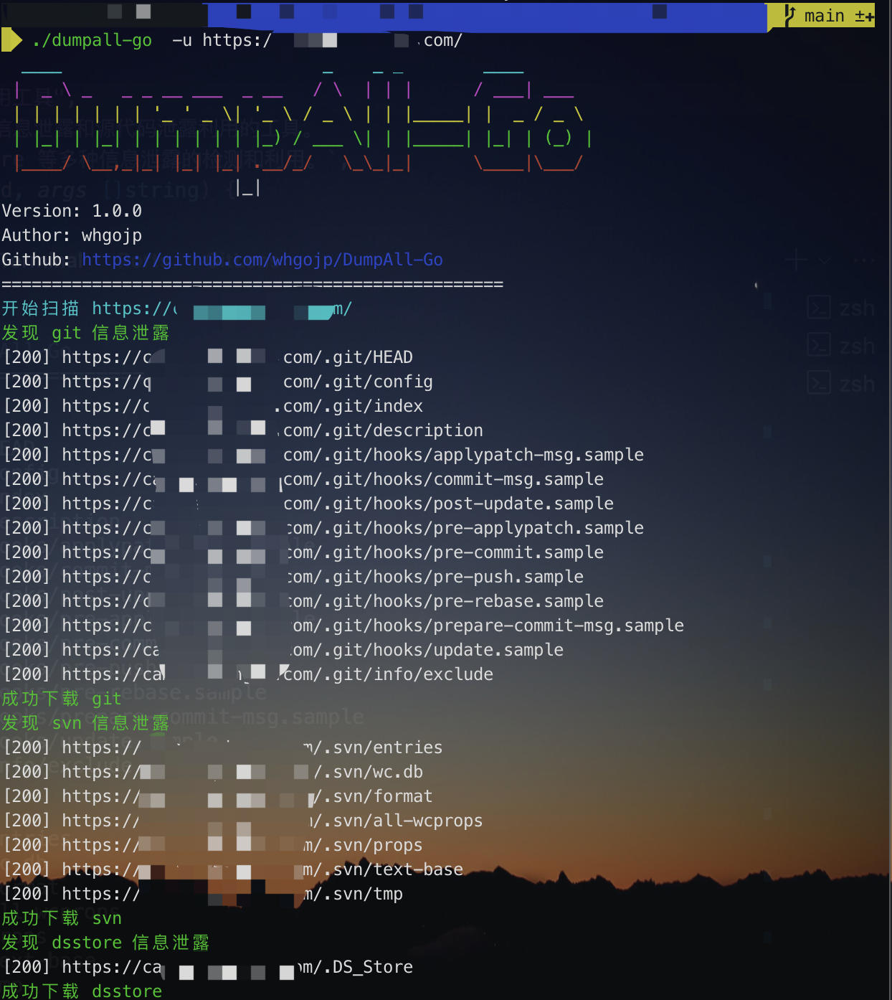
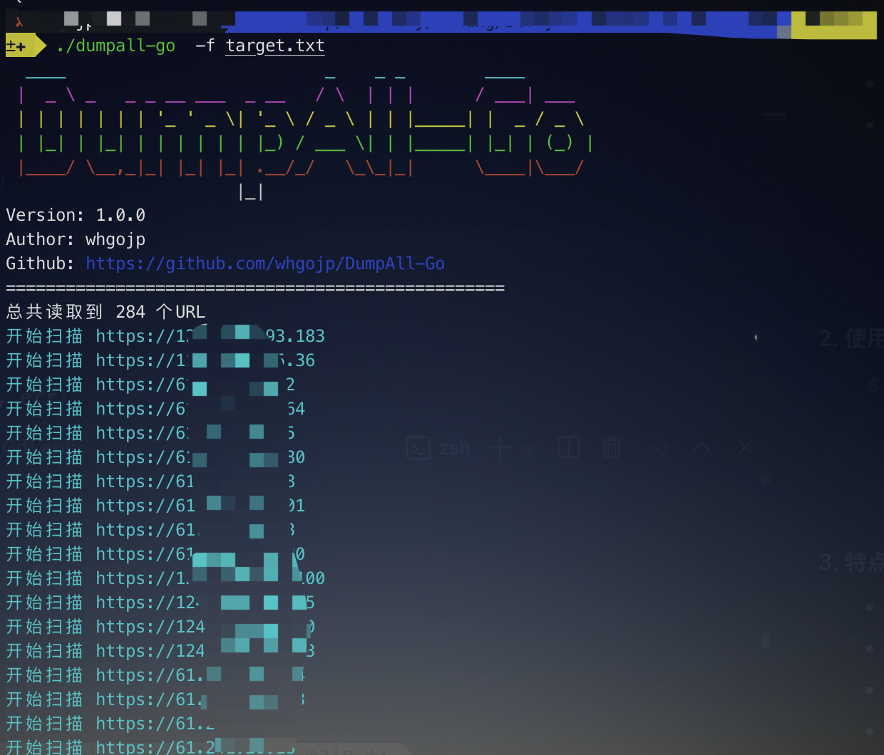

# DumpAll-Go

<div align="center">


[](https://github.com/whgojp/DumpAll-Go)
[](LICENSE)

[English](README_EN.md) | 简体中文

</div>

## 📖 简介

DumpAll-Go 是一个基于 [DumpAll](https://github.com/0x727/DumpAll) 的 Go 语言重构版本，用于自动化收集和提取网站敏感信息。本项目在保持原有功能的基础上，进行了全面的优化和改进。

### ✨ 主要特性

- 🚀 高性能：基于 Go 语言开发，运行效率更高
- 🌍 跨平台：支持 Windows、Linux、macOS 等主流操作系统
- 🎯 智能识别：自动识别多种信息泄露类型
- 📦 开箱即用：无需复杂的环境配置
- 🔄 并发处理：支持批量扫描多个目标
- 🛡️ 稳定可靠：更强的容错能力和稳定性

### 🎯 适用场景

- `.git` 源代码泄露
- `.svn` 源代码泄露
- `.DS_Store` 信息泄露
- 目录列表泄露

## 🚀 快速开始

### 安装

#### 方法一：直接下载二进制文件

从 [Releases](https://github.com/whgojp/DumpAll-Go/releases) 页面下载对应平台的二进制文件：

- Windows: `dumpall-go-windows-amd64.exe` 或 `dumpall-go-windows-386.exe`
- Linux: `dumpall-go-linux-amd64` 或 `dumpall-go-linux-386` 或 `dumpall-go-linux-arm64`
- macOS: `dumpall-go-darwin-amd64` 或 `dumpall-go-darwin-arm64`

#### 方法二：从源码编译

```bash
# 克隆仓库
git clone https://github.com/whgojp/DumpAll-Go.git

# 进入项目目录
cd DumpAll-Go

# 安装依赖
make deps

# 编译所有平台版本
make all

# 或只编译当前平台版本
make build

# 或单独编译特定平台
make build-windows  # 编译 Windows 版本
make build-linux    # 编译 Linux 版本
make build-darwin   # 编译 macOS 版本
```

编译后的文件将位于 `build` 目录下。

### 使用方法

```bash
Usage:
  dumpall-go [flags]

Flags:
  -u, --url string      目标URL
  -f, --file string     包含URL列表的文件
  -o, --outdir string   输出目录 (default "output")
  -p, --proxy string    代理服务器 (例如: http://127.0.0.1:8080)
  -w, --workers int     并发工作线程数 (default 10)
  -h, --help           查看帮助信息
```

### 使用示例

1. 扫描单个目标：
```bash
./dumpall-go -u http://example.com/
```



2. 批量扫描：
```bash
./dumpall-go -f target.txt
```



## 🤝 贡献指南

欢迎各种形式的贡献，包括但不限于：

- 提交问题和建议
- 改进文档
- 提交代码修复或新功能

## 📄 开源许可

When we speak of free software, we are referring to freedom, not price.

本项目采用 [Apache License 2.0](LICENSE) 开源许可证。

## 🙏 致谢

- 感谢原项目 [DumpAll](https://github.com/0x727/DumpAll) 的启发
- 感谢所有贡献者的支持
